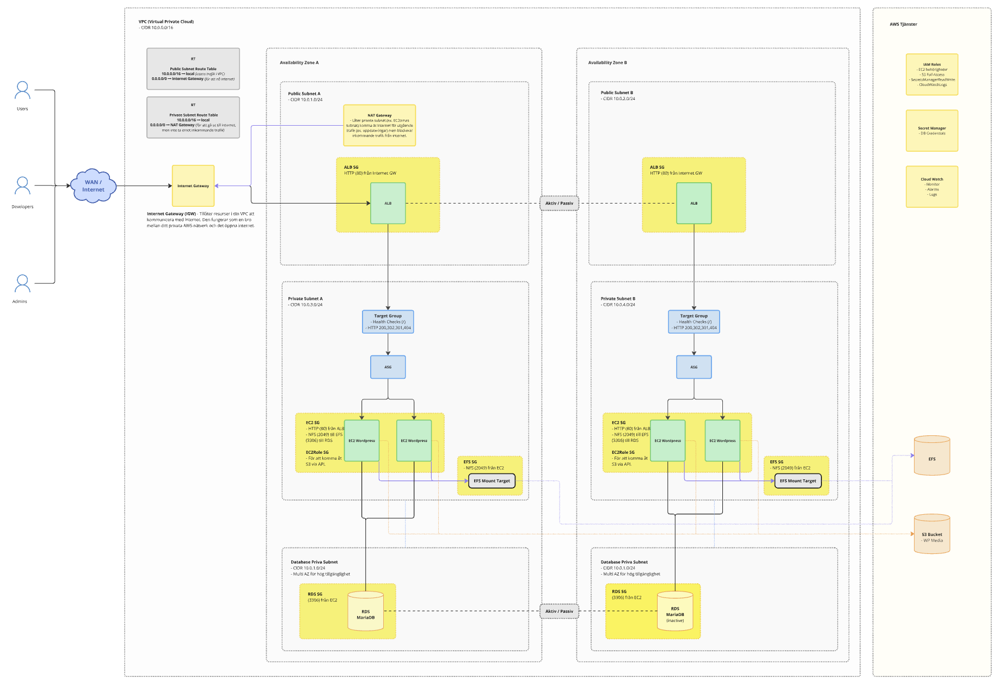
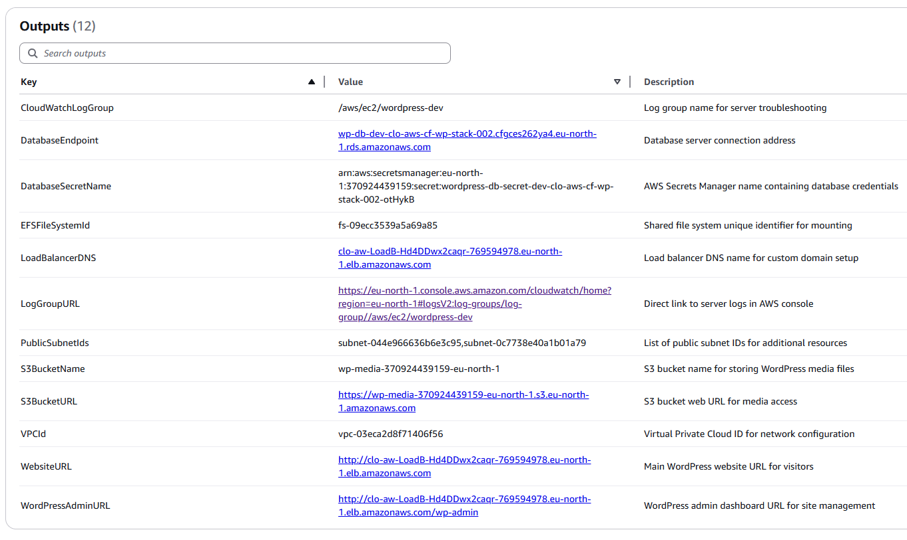
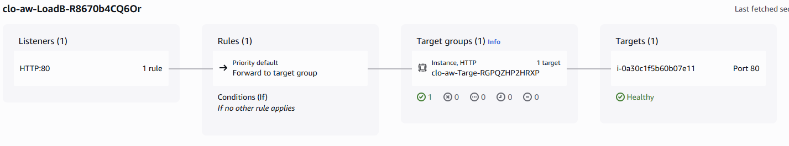
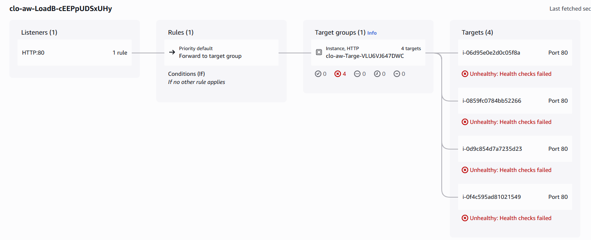

# Inlämningsuppgift 1 - Skalbara Molnapplikationer
> Av: Fredrik Svärd - CLO24  
> GitHub Repo: [GitHub Repo - Skalbara Molnapplikationer](https://github.com/sirhaffy/CloFreSva-SkalabaraMolnapplikationer/)  


## Uppgift 1. Designa en robust, säker och skalbar driftsmiljö för Wordpress.

- Basera lösningen på virtuella servrar på AWS.
- Beskriv vad de olika komponenterna i din design har för uppgift och syfte.
- Beskriv vilka åtgärder du vidtagit för skalbarhet och säkerhet.
- Redogör för vilka molntjänster du utnyttjat.

---

Jag förklarar delarna i lösningen nedan.




## Nätverksarkitektur
- **VPC (10.0.0.0/16)** - Isolerad nätverksmiljö för att köra resurser, i detta fall på EU-North. Av den enkla anledningen att det är en grön / miljöfokuserad anläggning.
- **Internet Gateway** - För att ge internetåtkomst och till resurser i VPC.
- **NAT Gateway** - Tillåter utgående internettrafik från privata subnät utan att exponera resurser för inkommande trafik från internet. Använder dynamisk IP för kostnadseffektivitet i utvecklingsmiljön. Egentligen är det nog bra att ha Elastic IP på denna om externa tjänster behöver veta vart traffiken kommer ifrån, men i mitt fall behövs det inte.
- **Public Subnets** - 10.0.1.0/24 och 10.0.2.0/24 för Application Load Balancer och NAT Gateway.
- **Private Subnets** - 10.0.3.0/24 och 10.0.4.0/24 för EC2-instanser, RDS-databas och EFS-lagring.

## Routing
- **Public Route Table**: Dirigerar intern VPC-trafik lokalt (10.0.0.0/16 → local) och all övrig trafik direkt till Internet Gateway (0.0.0.0/0 → IGW) för bidirektionell internetåtkomst.
- **Private Route Table**: Dirigerar intern VPC-trafik lokalt (10.0.0.0/16 → local) och utgående internettrafik via NAT Gateway (0.0.0.0/0 → NAT GW) för säker envägsåtkomst utan exponering för inkommande trafik.

## Säkerhet
Jag har separerat olika delar av infrastrukturen för att öka säkerheten, framförallt genom privata subnät och publika subnät. Har även en NAT Gateway för att möjliggöra säker internetåtkomst för resurser i de privata subnät, så som EC2orna. Så man ex. kan hämta uppdateringar (dnf update).

### Security Groups
Security groups fungerar egentligen som en brandväggsregel för att kontrollera trafik mellan olika delar.

- **ALB Security Group** – Tillåter enbart HTTP-trafik (port 80) från internet.
- **EC2 Security Group** - Tillåter HTTP-trafik från ALB (port 80). EC2-instanserna är nu isolerade i privata subnät utan direkt internetåtkomst/exponering och tar bara emot trafik genom ALB.
- **EFS Security Group** - Tillåter NFS-trafik (port 2049) från EC2 till EFS inom privata subnät.
- **RDS Security Group** - Tillåter MariaDB-trafik (port 3306) från EC2 till RDS inom privata subnät.
- **Förbättrad säkerhet**: SSH-åtkomst är helt borttagen och EC2, RDS, EFS är isolerade i privata subnät utan direkt internetåtkomst/exponering.

### IAM & Behörigheter

- **EC2 IAM-roll** – I CloudFormationTemplate.yaml skapas en IAM-roll som kopplas till EC2-instanserna via ett Instance Profile. Denna roll får:
    - Full åtkomst till alla S3-buckets i AWS-kontot (`AmazonS3FullAccess`) – för enkelhet i utvecklingsmiljö.
    - Läs- och skrivbehörighet till AWS Secrets Manager (`SecretsManagerReadWrite`) för att hämta och lagra hemligheter, t.ex. databaslösenord.
    - Full åtkomst till CloudWatch Logs (`CloudWatchLogsFullAccess`) för loggning och övervakning.
- **Instance Profile** – Rollen kopplas automatiskt till EC2-instanserna vid uppstart via ett Instance Profile, så att instanserna får nödvändiga rättigheter utan att behöva lagra några credentials lokalt.
- **Säker hantering av credentials** – Databaslösenord lagras aldrig i klartext i CloudFormation-mallen. Istället används AWS Secrets Manager, och RDS-databasen hämtar credentials direkt via referensen `{{resolve:secretsmanager:...}}` i mallen.
- **Sammanfattning** – All hantering av känsliga uppgifter sker via IAM och Secrets Manager. EC2-instanserna får automatiskt rättigheter via rollen och Instance Profile, och inga lösenord lagras i klartext i någon mall eller på någon instans. Detta går absolut jobbas mer med, men det är en början.

## Lastbalansering och trafikhantering
- **Application Load Balancer** – Lastbalanseraren/rna (ALB) är placerad i publika subnät som hanterar inkommande HTTP-trafik och fördelar den säkert till EC2-instanser via ASG i privata subnät för maximal säkerhet och hög tillgänglighet.
- **Target Group** – Tar emot trafik från Application Load Balancer (ALB) och dirigerar den till EC2-instanser i privata subnät via ASG. 
- **Listener** – Lyssnar på HTTP-trafik på Application Load Balancer (ALB) och vidarebefordrar inkommande förfrågningar till Target Group, vilket möjliggör trafikflöde från publika till privata subnät via lastbalanseraren (ALB).

## Auto Skalning och Monitorering
- **Launch Template** - Är mallen som definierar inställningarna för de EC2-instanser som ska skapas, inklusive AMI (Amazon Linux 2023), instanstyp, nätverksinställningar, IAM-roll, UserData-skript (beskrivs mer senare).
- **Auto Scaling Group** – Konfigurerar min/max/önskat antal instanser (2-5) för att automatiskt anpassa antalet WordPress-servrar i privata subnät baserat på belastning och tillgänglighet.
- **CPU-based Scaling Policies** - Skalar upp vid 40% CPU belastning, och ner vid 30% CPU belastning.
- **CloudWatch Alarms** - Övervakning av CPU-användning som utlöser skalningsåtgärder.
- **NAT Gateway** - Möjliggör för EC2-instanser i privata subnät att få utgående internetåtkomst för uppdateringar och paketinstallationer utan att exponera dem för inkommande trafik.

## Storage & Database
- **EFS-filsystem** – Krypterad, delad lagring för WordPress-filer..
- **EFS Mount Targets** - Placerade i de privata subnäten (10.0.3.0/24 och 10.0.4.0/24) för att säkerställa att EFS-filsystemet är tillgängligt för alla EC2-instanser i båda tillgänglighetszoner utan internetexponering.
- **MariaDB RDS** - Databasen körs i AWS RDS (Relational Database Service) inom privata subnät, vilket innebär att AWS sköter drift, underhåll och backup. Databasen är konfigurerad med `PubliclyAccessible: false` för säkerhetens skull, jag hade den på true i början för att kolla så den kom igång riktigt.
- **DB Subnet Group** - Konfigurerad för privata subnät i båda tillgänglighetszoner (AZ) för tillgänglighet, men utan MultiAZ för kostnadseffektivitet. EC2-instanserna i de privata subnäten har direkt nätverksåtkomst till RDS-databasen inom samma VPC.
- **S3 Bucket** - Objektlagring för WordPress mediafiler (bilder, dokument etc). EC2-instanserna får åtkomst till bucketen via IAM-roller med breda rättigheter (AmazonS3FullAccess för enkelhets skull i utvecklingsmiljö).

## Hälsokontroller via Application Load Balancer
Application Load Balancer (ALB) är konfigurerad att regelbundet utföra hälsokontroller mot rotadressen (`/`) på varje WordPress-instans (EC2). 
Vid varje kontroll skickar ALB en HTTP-förfrågan till vardera instans och förväntar sig ett svar med statuskod 200, 301, 302 eller 404. Om en instans inte svarar med någon av dessa koder markeras den som ohälsosam och tas automatiskt bort från trafikflödet tills den åter är frisk. Detta säkerställer att endast fungerande instanser tar emot trafik, vilket ökar tillgängligheten och stabiliteten i miljön genom att trafik endast dirigeras till friska instanser i de privata subnäten.

## Säker lösenordshantering implementerad
Jag har implementerat en lösning som använder sig av AWS Secrets Manager, som automatisk genererar ett säkert lösenord på 20-tecken. Utesluter problematiska tecken: '"@/\^`~(){}[]|;:,.<>?*&#%$!' och kräver stora/små bokstäver, siffror (RequireEachIncludedType: true), inga mellanslag (IncludeSpace: false). Lagrar både användarnamn (wpuser) och lösenord på ett säkert sätt.

## Distribution och konfiguration av WordPress
- **EC2-instanser** är nu deployade i privata subnät (10.0.3.0/24 och 10.0.4.0/24) för maximal säkerhet och monterar Amazon EFS som delad lagring för `/var/www/html`, vilket säkerställer att WordPress-filer (teman, plugins, uppladdningar) är synkroniserade mellan alla instanser.
- **Utgående internetåtkomst** sker säkert via NAT Gateway, vilket möjliggör paketuppdateringar och API-anrop utan att exponera instanserna för inkommande internettrafik.
- **Databasuppkoppling** sker via miljövariabler som hämtas säkert från AWS Secrets Manager med `jq`, helt inom VPC:s privata nätverk utan internetexponering.
- **UserData-skriptet** installerar nödvändiga verktyg (`awscli`, `jq`, `amazon-efs-utils`) och startar WordPress-containern först efter att anslutning till databasen har verifierats, allt via säkra interna nätverksanslutningar. I detta fallet används `jq` för att extrahera lösenordet ur JSON-objekt som hämtas från AWS Secrets Manager, vilket är mer robust än att använda grep eller sed.
- **Automatisk distribution** och konfiguration sker vid uppstart av instanserna, vilket möjliggör snabb återställning och enkel horisontell skalning inom den säkra privata nätverksmiljön.
- **Docker WordPress 6.4-Apache** körs i en container för att separera applikationen från operativsystemet och förenkla distribution och skalning.
- **EFS-integration** ger delad, krypterad lagring av WordPress-data mellan alla EC2-instanser över flera tillgänglighetszoner.
- **AWS Secrets Manager** hanterar Databaslösenordet säkert och hämtas av EC2-instanserna vid uppstart. Övriga anslutningsuppgifterna som används, så som anslutningsparametrar (t.ex. databasnamn, användarnamn, host) anges direkt i CloudFormation-mallen och UserData-skriptet.



---

## Uppgift 2. Gör en tydlig avgränsning i din design och beskriv sedan steg för steg hur du
provisionerar driftsmiljön samt konfigurerar din applikation.

- Var tydlig med vilka verktyg du använder
- Hur du använder IaC och automation - om du gör det.

---

Jag använder IaC i form av CloudFormation (även om jag kanske skulle valt annat om jag fick välja). Jag definierar alla mina resurser i en YAML-mall, vilket gör det enkelt att reproducera och versionera min infrastruktur i ex. GitHub. Jag har även lagt upp den i ett GitHub-repo, länk finns på sida 1. 

Jag provade att koppla in GitSync men det visade sig vara för stort jobb för denna uppgiften. Mer lämpad för permanenta lösningar. Men jag kom en bit på väg innan jag scrapade det.

## GitSync

Skapade en IAM roll för GitSync.

```bash
# Skapa trust policy för CloudFormation
aws iam create-role \
    --role-name CloudFormation-WordPressStack-Role \
    --assume-role-policy-document '{
        "Version": "2012-10-17",
        "Statement": [
            {
                "Effect": "Allow",
                "Principal": {
                    "Service": "cloudformation.amazonaws.com"
                },
                "Action": "sts:AssumeRole"
            }
        ]
    }'
```
Sen gav jag rättigheter till AWS att hantera repot i GitHub, men sen stoppade jag. Det var en hel del som behövde göras för att få det att fungera.

## AWS CLI

AWS CLI var också något jag använde flitigt.

Några komandon som jag använde:
```bash
# Skapa stacken
aws cloudformation create-stack \
    --stack-name clo-aws-cf-wp-stack \
    --template-body file://CloudFormationTemplate.yaml \
    --capabilities CAPABILITY_IAM CAPABILITY_NAMED_IAM

# Stack status
aws cloudformation describe-stacks --stack-name clo-aws-cf-wp-stack

# Uppdatera stacken
aws cloudformation update-stack \
    --stack-name clo-aws-cf-wp-stack  \
    --template-body file://CloudFormationTemplate.yaml \
    --capabilities CAPABILITY_IAM

# Ta bort stacken
aws cloudformation delete-stack --stack-name clo-aws-cf-wp-stack

# Hämta lösenordet för den nya stacken från Secrets Manager
aws secretsmanager get-secret-value \
  --secret-id wordpress-db-secret-dev-clo-aws-cf-wp-stack \
  --region eu-north-1 \
  --query SecretString --output text | jq -r .password

# Eller hela JSON-objektet för hemligheten
aws secretsmanager get-secret-value \
  --secret-id wordpress-db-secret-dev-clo-aws-cf-wp-stack \
  --region eu-north-1 \
  --query SecretString --output text
```

Jag tyckte det var smidigt men aningen rörigt att arbeta med, då det tog n stund att hitta komandona jag behövde. Azures CLI är mer utvecklad helt klart, men det funkade för mitt behov i denna uppgiften.


## Auto skalning och Stress-testning

Jag märkte när jag stressade utifrån (med nedan komando) så kom man åt instanser (EC2or med Wordpress) som ännu inte är redo för trafik. Det fick mig att börja felsöka och ledde mig in på en hel del sidospår.
Jag körde testen utifrån då jag hade stängt ner SSH trafik av säkerhetsskäl, visst jag kunde satt upp en bastian/jump-host för detta. Men det kändes inte hållbart då det autoskalade och skulle jag pressa potentiellt 4 maskiner samtidigt så blev det lätt rörigt. Bättre att stressa utifrån, då tror jag faktisk att jag träffar ALBn direkt istället för bara EC2orna, men där är jag lite osäker.

> _Det bilderna visar är från olika stacks, men De visar vad som händer._

Innan skalning:


Överbelastad:


Olika stress komandon som jag använde.
```bash
# Parametrar
URL="http://clo-aw-LoadB-R8670b4CQ6Or-1721134484.eu-north-1.elb.amazonaws.com"
TEST_DURATION=30  # sekunder
REQUESTS_PER_ROUND=1000
ROUNDS_TOTAL=100

echo "Startar belastningstest - stängs automatiskt efter $TEST_DURATION sekunder"

# Starta testet i bakgrunden
nohup bash -c '
    for round in {1..'"$ROUNDS_TOTAL"'}; do 
        echo "$(date): Rund $round - Skickar '"$REQUESTS_PER_ROUND"' requests..."
        for i in {1..'"$REQUESTS_PER_ROUND"'}; do 
            curl -s --connect-timeout 3 --max-time 10 "'"$URL"'" >/dev/null 2>&1 & 
        done
        sleep 3
    done
' > load_test.log 2>&1 &

# Spara process-ID och auto-stop
TEST_PID=$!
echo "Test startad med PID: $TEST_PID"

# Vänta och stoppa automatiskt
sleep $TEST_DURATION
kill $TEST_PID 2>/dev/null
pkill curl 2>/dev/null
echo "Belastningstest avslutad automatiskt efter $TEST_DURATION sekunder"
```

Provade att lägga in detta före starten av WP för att kolla så den når databasen.

```bash
# Test database connectivity before starting WordPress (simplified)
echo "$(date): Testing basic database connectivity..."
for i in {1..10}; do
  if nc -z "$DB_HOST" 3306; then
    echo "$(date): Database port 3306 is reachable!"
    break
  else
    echo "$(date): Database port not reachable, retrying... ($i/10)"
    sleep 5
  fi
done
```

Sen la jag också in en check på WP själv.

```yaml
# Wait for WordPress to be ready
echo "$(date): Waiting for WordPress to respond..."
for i in {1..30}; do
    http_status=$(curl -s -o /dev/null -w "%{http_code}" http://localhost/ 2>/dev/null)
    if [ "$http_status" = "200" ] || [ "$http_status" = "302" ]; then
    echo "$(date): WordPress is ready! HTTP status: $http_status"
    break
    fi
    echo "$(date): WordPress not ready yet (HTTP: $http_status), waiting... ($i/30)"
    sleep 10
done

echo "$(date): Setup completed - instance ready for traffic"

```

La också in 'UpdatePolicy' för att alltid starta om instanserna vid uppdatering av CloudFormation-mallen, efter tips av dig Lars.

Det verkade fortfarande som om micro instanserna (t3.micro) är för klena för den belastningen, dom throttlar och sen dör dom av på något sätt och lägger sig på 20% cpu load efter att ha fått flertalet boosts av AWS. 
I kombination med min 1 instans vid belastning så slutar dom funka. Jag sänkte efter det till 40% CPU gräns på ASG och satte min 2 instanser för att dom skall kunna hantera load tills fler instanser hinner starta. Men lösningen hade varit att använda kraftigare VMs, men eftersom det kostar pengar och detta inte är en vital lösning som skall ligga ute så bytte jag istället till en mindre kraftig stresstestalgoritm.

```bash
URL="http://clo-aw-LoadB-R8670b4CQ6Or-1721134484.eu-north-1.elb.amazonaws.com"

echo "Startar belastningstest - stängs automatiskt efter 30 sekunder"

# Starta testet i bakgrunden
nohup bash -c 'for round in {1..100}; do echo "$(date): Rund $round - Skickar 1000 requests..."; for i in {1..1000}; do curl -s --connect-timeout 3 --max-time 10 "'"$URL"'" >/dev/null 2>&1 & done; sleep 3; done' > load_test.log 2>&1 &

# Spara process-ID
TEST_PID=$!
echo "Test startad med PID: $TEST_PID"

# Vänta 30 sekunder och döda testet
sleep 30
kill $TEST_PID 2>/dev/null
pkill curl 2>/dev/null
echo "Belastningstest avslutad efter 30 sekunder"
```

Det fungerade tillsut, men det kräver helt klart monitorering för att ha koll på detta i en live-miljö. Och jag är helt på det klara med att jag bara skrapat på ytan i detta, finns mycket att lära sig här.

## Cloud Formation Mallen
För att inte dumpa hela CloudFormation Mallen här så har jag lagt upp den på GitHub. Här är en direktlänk:  
[CloudFormationTemplate.yaml](https://github.com/sirhaffy/CloFreSva-SkalabaraMolnapplikationer/blob/main/CloudFormationTemplate.yaml)

## Sammanfattning
Det finns mycket mer att lära sig och förbättra, men jag tyckte detta var en rolig uppgift som jag lärde mig mycket av. Jag har velat lära mig hantera AWS och jag inser att det är mycket kvar, men att få komma in såhär och börja labba ger väldigt mycket.

Jag skulle gärna lagt in CloudWatch och Agenten för det till lösningen, men jag hade egentligen inte tid att implementera det också.

Skulle också kunna lägga in en bastion / jump host för att öka säkerheten och möjliggöra säker åtkomst till de privata resurserna. Med flera olika säkerhetslösningar, så som Security Groups, NACLs och IAM-roller, kan man skapa en robust och säker infrastruktur. Men även Fail2Ban, RKHunter, Logwatch, Inaktivera root inloggning och lösenordsautentisering för att öka säkerheten. Men jag har visat att jag hanterar det innan så hoppade det i denna inlämningen.

Jag la ganska mycket nergi på att få till en överblick i form av diagram över lösningen, då det hjälper mig förstå bättre. Jag tror jag har fått ihop något som är användbart. Men jag måste säga att jag trodde verkligen att AWS hade en bättre lösning för detta, likt Azures. Det fanns andra alternativ, med alla kostade pengar och ingen var egentligen vad jag sökte. Så jag gjorde min i Miro, som funkar ok.

Koppla ihop allt i ett GitHub Repo för Infrastrukturen har jag gjort, men jag har inte automatiserat det med GitHub Actions osv denna gången, som jag gjorde i projekarbetet.

Men allt som allt så är jag nöjd med det jag har åstadkommit och vad jag har lärt mig.

---